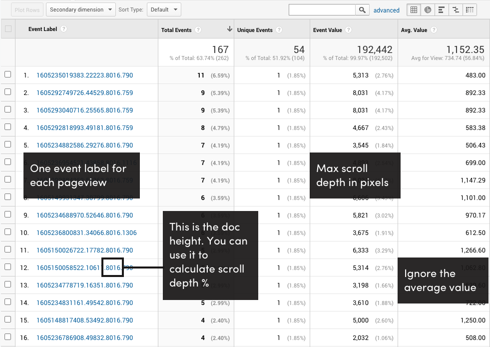

# Scroll Depth 2
Alpha version of a better way to measure scroll depth. This is the next version of the original [Scroll Depth](https://github.com/robflaherty/scroll-depth) library.

Intended for people comfortable working with GA data outside of the web UI. 

Features and data structure are still in flux so I'd recommend only using in test environments.

Feedback welcome!

## What it does
The script generates a unique ID for each pageview and sends the ID as the Event Label. Scroll depth is a pixel value recorded by incrementing the Event Value.

The pageview ID includes the document height, which can be used to calculate the percent of the page scrolled, and the viewport height, which can be used to calculate the number of screens scrolled.

Example:

`1604195775299.26174.8016.744`

`{timestamp}.{random number}.{document height}.{viewport height}`



## Pixel Depth
The script keeps track of the max scroll depth, in pixels, and sends an event when `visibilityState` changes to `hidden` as a way of recording the deepest scroll point when the tab is closed or the user switches tabs. If a user returns to the tab and continues scrolling, the event value is updated the next time `visibilityState` changes to `hidden` again.

## Milestones
Milestones are specified DOM elements that have been scrolled into view. They're reported as the total number of milestones scrolled into view. You can pass a list of selectors in the options or add the class `.scroll-milestone` to elements that should be treated as milestones. If doing the latter, you need to turn on milestone tracking by setting the `milestones` option to `true`.

## How to use
```
<script src="scrolldepth.js"></script>
<script>
  scrolldepth.init()
</script>
```

## Options
```
<script>
  scrolldepth.init({
    milestones : {
      selectors: ['.first-milestone', '.another-milestone'],
      offset: 100
    }
  })
</script>
```


## Notes

- Requires gtag
- Doesn't support IE11

